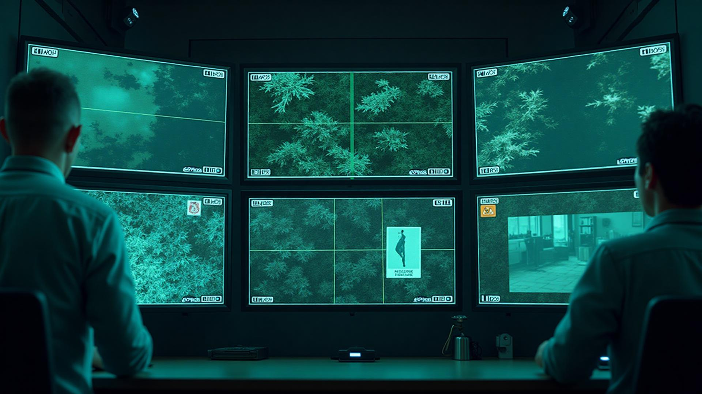

# Hackathon Candidate Problem-Solving Quiz

<div align="center">



**Hackathon Candidate Problem-Solving Quiz**

</div>

## 📋 نظرة عامة

Video Frame Detective هو تطبيق ويب متطور يحل مشكلة **كشف الإطارات المفقودة في أنظمة المراقبة الذكية**. يوفر التطبيق ثلاث خوارزميات مختلفة لتحليل وعرض الإطارات المفقودة بطريقة بصرية فريدة وتفاعلية.

### 🎯 المشكلة المحلولة

في أنظمة المراقبة الذكية، تُرسل الكاميرات إطارات الفيديو كسلسلة من الصور المرقمة تسلسلياً (1, 2, 3, ...). بسبب مشاكل الشبكة أو تأخير الأجهزة، قد لا يتم استقبال بعض الإطارات. هذا التطبيق يحلل أرقام الإطارات المستلمة ويكتشف الإطارات المفقودة.

## ✨ المميزات

### 🔧 ثلاث خوارزميات متقدمة:

1. **Detecting Missing Video Frames**:

   - خوارزمية بسيطة لكشف الإطارات المفقودة
   - مناسبة للاستخدام العادي
   - تعقيد زمني: O(n)

## code solve

<div align="auto">
   function findMissingFrames(frames: number[]): number[] {
  if (!Array.isArray(frames) || frames.length === 0) {
    return [];
  }

const missingFrames: number[] = [];
let expectedFrame: number = 1;

for (const currentFrame of frames) {
if (currentFrame > expectedFrame) {
for (let j = expectedFrame; j < currentFrame; j++) {
missingFrames.push(j);
}
}

    expectedFrame = currentFrame + 1;

}

return missingFrames;
}

const frames1: number[] = [1, 2, 3, 5, 6];
console.log(`Input: [${frames1}]`);
console.log(`Missing frames: [${findMissingFrames(frames1)}]`);
console.log('---');

const frames2: number[] = [3, 4, 7, 8, 10];
console.log(`Input: [${frames2}]`);
console.log(`Missing frames: [${findMissingFrames(frames2)}]`);
console.log('---');

const frames3: number[] = [1, 2, 3, 4, 5];
console.log(`Input: [${frames3}]`);
console.log(`Missing frames: [${findMissingFrames(frames3)}]`);
console.log('---');

const frames4: number[] = [1, 5, 6, 7];
console.log(`Input: [${frames4}]`);
console.log(`Missing frames: [${findMissingFrames(frames4)}]`);
console.log('---');

const frames5: number[] = [];
console.log(`Input: [${frames5}]`);
console.log(`Missing frames: [${findMissingFrames(frames5)}]`);
console.log('---');

</div>

2. **Missing Frame Ranges Analysis**:

   - يحلل النطاقات المفقودة
   - يحدد أطول نطاق مفقود
   - يحسب إجمالي الإطارات المفقودة
   - تعقيد زمني: O(n log n)

## code solve

<div align="auto">
function findMissingFrames(frames: number[]): {
  missingRanges: [number, number][];
  longestMissingRange: [number, number] | null;
  totalMissingFrames: number;
} {
  if (!Array.isArray(frames) || frames.length === 0) {
    return {
      missingRanges: [],
      longestMissingRange: null,
      totalMissingFrames: 0
    };
  }

const maxFrame = Math.max(...frames);
const missingRanges: [number, number][] = [];
let longestMissingRange: [number, number] | null = null;
let totalMissingFrames: number = 0;
let expectedFrame: number = 1;

for (const currentFrame of frames) {
if (currentFrame > expectedFrame) {
const start = expectedFrame;
const end = currentFrame - 1;
const length = end - start + 1;

      missingRanges.push([start, end]);
      totalMissingFrames += length;

      if (!longestMissingRange || length > (longestMissingRange[1] - longestMissingRange[0] + 1)) {
        longestMissingRange = [start, end];
      }
    }
    expectedFrame = currentFrame + 1;

}

if (maxFrame > expectedFrame - 1) {
const start = expectedFrame;
const end = maxFrame;
const length = end - start + 1;

    missingRanges.push([start, end]);
    totalMissingFrames += length;

    if (!longestMissingRange || length > (longestMissingRange[1] - longestMissingRange[0] + 1)) {
      longestMissingRange = [start, end];
    }

}

return {
missingRanges,
longestMissingRange,
totalMissingFrames
};
}

const frames2: number[] = [1, 2, 5, 8, 9, 15];
const result2 = findMissingFrames(frames2);
console.log(`Input: [${frames2}]`);
console.log("Missing Ranges:", result2.missingRanges);
console.log("Longest Missing Range:", result2.longestMissingRange);
console.log("Total Missing Frames:", result2.totalMissingFrames);

</div>

3. **Find Missing Ranges (No Sort)**:
   - خوارزمية Hash Set متقدمة
   - لا تحتاج لترتيب البيانات
   - أداء محسن للتطبيقات عالية الأداء
   - تعقيد زمني: O(n)

## code solve

<div align="auto">
function findMissingFrameData(frames: number[]): {
  gaps: [number, number][];
  longest_gap: [number, number] | null;
  missing_count: number;
} {
  if (!frames || frames.length === 0) {
    return {
      gaps: [],
      longest_gap: null,
      missing_count: 0
    };
  }

const frameSet: Set<number> = new Set(frames);
const maxFrame: number = Math.max(...frames);

const gaps: [number, number][] = [];
let longestGap: [number, number] | null = null;
let missingCount: number = 0;

let currentGapStart: number | null = null;

for (let i = 1; i <= maxFrame; i++) {
if (!frameSet.has(i)) {
missingCount++;
if (currentGapStart === null) {
currentGapStart = i;
}
} else {
if (currentGapStart !== null) {
const gap: [number, number] = [currentGapStart, i - 1];
gaps.push(gap);
if (!longestGap || (gap[1] - gap[0] + 1) > (longestGap[1] - longestGap[0] + 1)) {
longestGap = gap;
}
currentGapStart = null;
}
}
}

if (currentGapStart !== null) {
const gap: [number, number] = [currentGapStart, maxFrame];
gaps.push(gap);
if (!longestGap || (gap[1] - gap[0] + 1) > (longestGap[1] - longestGap[0] + 1)) {
longestGap = gap;
}
}

return {
gaps,
longest_gap: longestGap,
missing_count: missingCount
};
}

const frames1_ts: number[] = [1, 2, 3, 5, 6, 10, 11, 16];
const result1_ts = findMissingFrameData(frames1_ts);
console.log(`Input: [${frames1_ts}]`);
console.log(result1_ts);
console.log('---');

const frames2_ts: number[] = [8, 5, 1, 2, 9];
const result2_ts = findMissingFrameData(frames2_ts);
console.log(`Input: [${frames2_ts}]`);
console.log(result2_ts);
console.log('---');

const frames3_ts: number[] = [1, 100];
const result3_ts = findMissingFrameData(frames3_ts);
console.log(`Input: [${frames3_ts}]`);
console.log(result3_ts);
console.log('---');

const frames4_ts: number[] = [1, 2, 3];
const result4_ts = findMissingFrameData(frames4_ts);
console.log(`Input: [${frames4_ts}]`);
console.log(result4_ts);

</div>

## 🚀 التشغيل السريع

### المتطلبات الأساسية

- Node.js (الإصدار 18 أو أحدث)
- npm أو yarn أو pnpm

### التثبيت والتشغيل

```bash
# 1. استنساخ المشروع
git clone <YOUR_GIT_URL>
cd video-frame-detective

# 2. تثبيت التبعيات
npm install

# 3. تشغيل الخادم المحلي
npm run dev

# 4. فتح المتصفح على
# http://localhost:8080
```

## 🛠️ التقنيات المستخدمة

- **React 18**: مكتبة الواجهة الأمامية
- **TypeScript**: لغة البرمجة المطبوعة
- **Tailwind CSS**: إطار عمل الأنماط
- **Vite**: أداة البناء السريعة
- **Lucide React**: مكتبة الأيقونات
- **Radix UI**: مكونات واجهة المستخدم
- **React Query**: إدارة حالة الخادم

[🌐 العرض المباشر](https://hackathon-candidate-problem-solving.vercel.app/)

</div>
